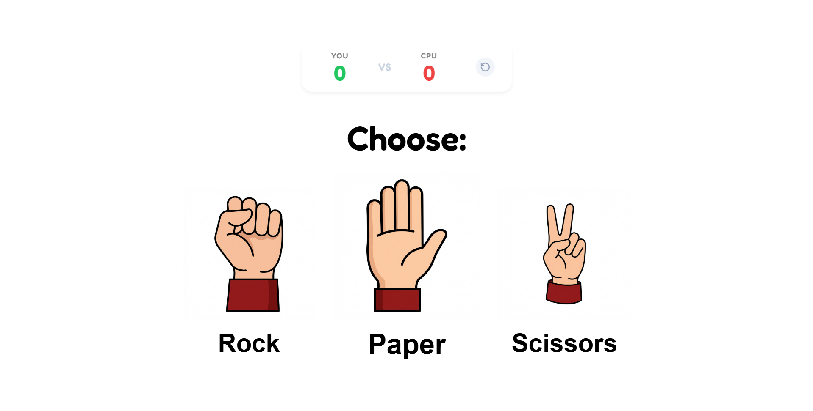

# 🎮 Neon Rock Paper Scissors

A modern, high-energy twist on the classic game! Built with vanilla HTML, CSS, and JavaScript, this project features a **Best of 3 Series** format, smooth animations, and a vibrant neon aesthetic.

  

## ✨ Features

- **🏆 Best of 3 Series**: Play a full match! The first to win 3 decisive rounds takes the crown.
- **🎨 Neon Cyberpunk Design**: Sleek glassmorphism effects, vibrant colors, and 3D-style icons.
- **⚡ Dynamic Animations**: 
    - "Shake, Shake, Shoot!" hand animations.
    - "Pop-in" Victory/Defeat text.
    - 🎉 **Confetti Celebration** for the series winner!
- **🤖 Smart CPU**: Logic tuned to reduce repetitive draws for a faster-paced game.
- **📱 Fully Responsive**: Looks great on desktop and mobile.
- **🔄 Instant Replay**: "Play Again" and manual reset options for endless fun.

## 🛠️ Tech Stack

- **HTML5** - Semantic structure.
- **CSS3** - Flexbox, CSS Variables, Keyframe Animations, and Media Queries.
- **JavaScript (ES6+)** - Game logic, DOM manipulation, and Canvas confetti.

## 🚀 How to Play

1.  **Choose your weapon**: Rock ✊, Paper ✋, or Scissors ✌️.
2.  **Watch the showdown**: Both hands shake... 1, 2, 3... SHOOT!
3.  **Track the score**: The "YOU vs CPU" scoreboard updates instantly.
4.  **Win the Series**: Be the first to win **3 rounds** to trigger the Victory Confetti!

## 📦 Improvements

- [x] Result revealed after 3 shakes (1.3s delay).
- [x] "Play Again" button hidden during animations for a seamless look.
- [x] Draw probability reduced for more decisive gameplay.
- [x] Auto-reset logic replaced with a definitive "Series Over" state.

## 👨‍💻 Author

**Abhijit Singh**  
[GitHub](https://github.com/abhijitsingh003)

---

*Enjoy the game! 🕹️*
